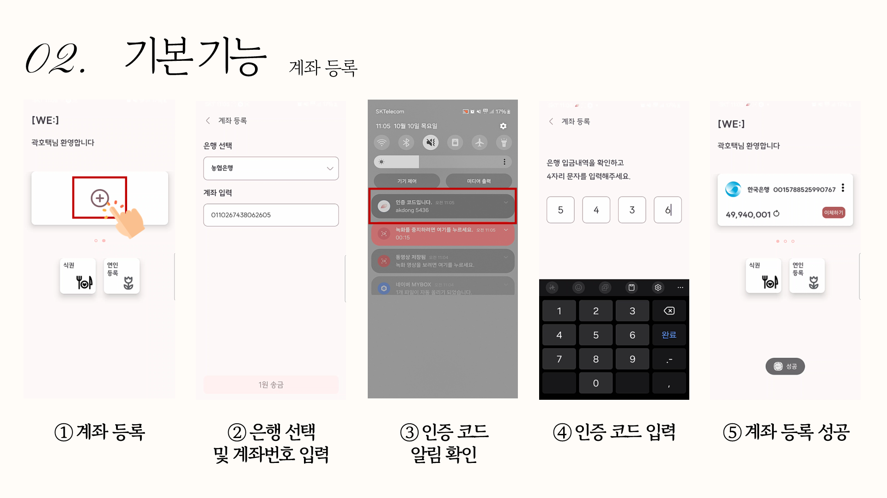
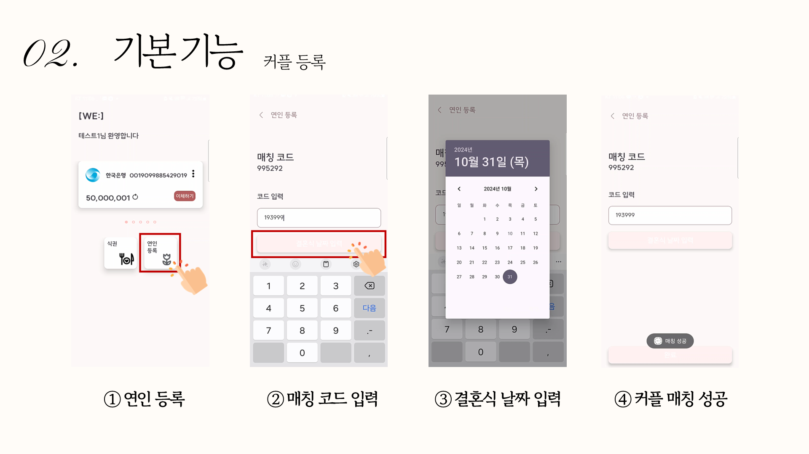
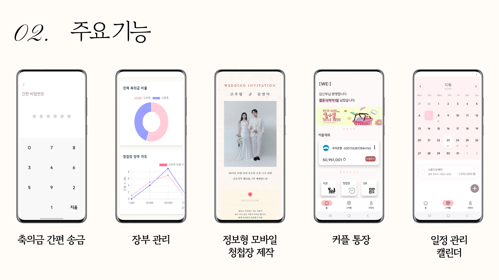
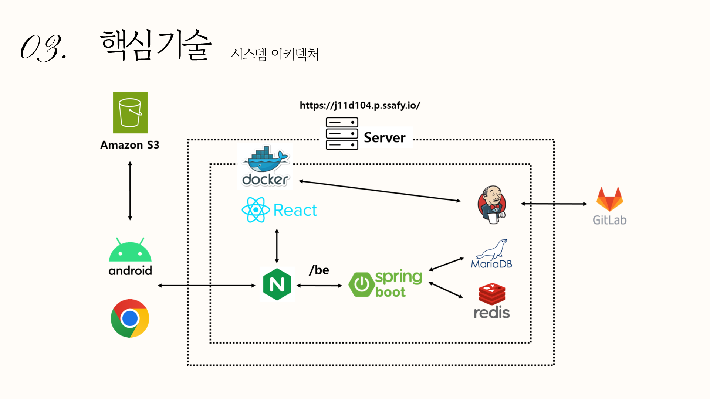
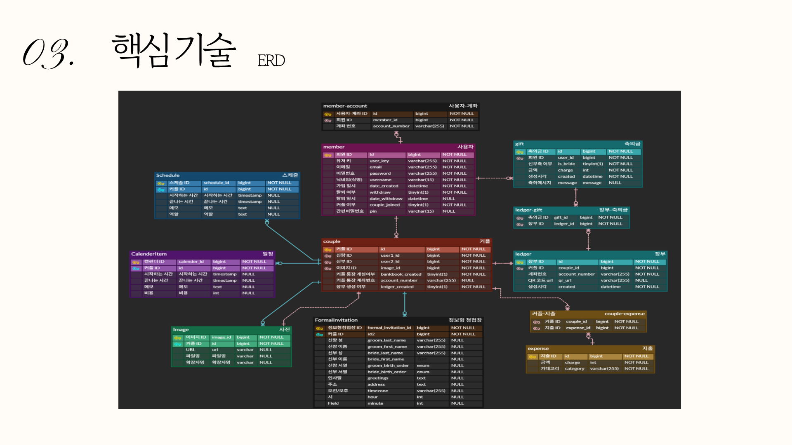

# 프로젝트 이름

청첩장 제작 및 결혼식 장부, 송금 간편화 핀테크 앱 

## 1. 프로젝트 개요

- **프로젝트 기간**: 2024.09.02 ~ 2024.10.11
- **참여 인원**: 개발자 6명 (안드로이드 2명, 프론트 2명, 백엔드 2명)
- **사용 기술**: 
  - 언어: Java, Kotlin, JavaScript
  - 프레임워크:  Spring Boot, React
  - 데이터베이스:  MySQL, MongoDB
  - 도구: Git, Jenkins, Docker, Jira

## 2. 주요 기능 및 설명

## 3. 아키텍쳐 구조

## 4. 데이터 베이스 구조

## 5. commit convention
- ⭐feat : 기능 (새로운 기능)
- 🛠fix : 버그 (버그 수정)
- ⚒refactor : 리팩토링
- 🎨design : CSS 등 사용자 UI 디자인 변경
- 💬comment : 필요한 주석 추가 및 변경
- 🖍️style : 스타일 (코드 형식, 세미콜론 추가: 비즈니스 로직에 변경 없음)
- ✏docs : 문서 수정 (문서 추가, 수정, 삭제, README)
- 📋test : 테스트 (테스트 코드 추가, 수정, 삭제: 비즈니스 로직에 변경 없음)
- 👏chore : 기타 변경사항 (빌드 스크립트 수정, assets, 패키지 매니저 등)
- 📃init : 초기 생성
- 🔙rename : 파일 혹은 폴더명을 수정하거나 옮기는 작업만 한 경우
- ✂remove : 파일을 삭제하는 작업만 수행한 경우
